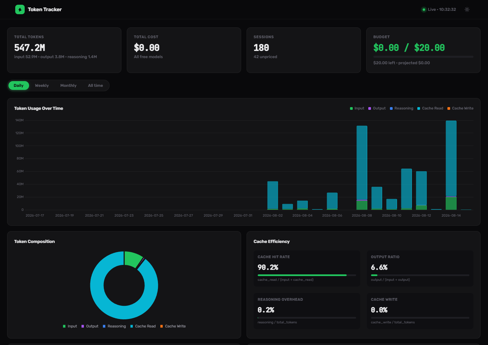
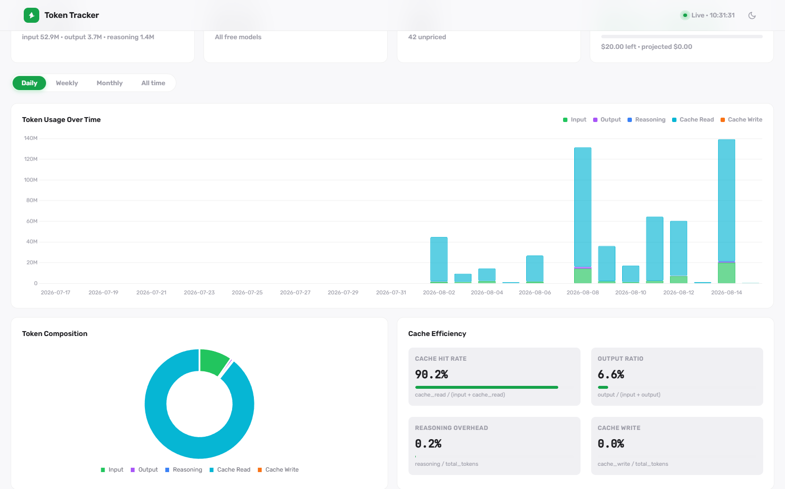
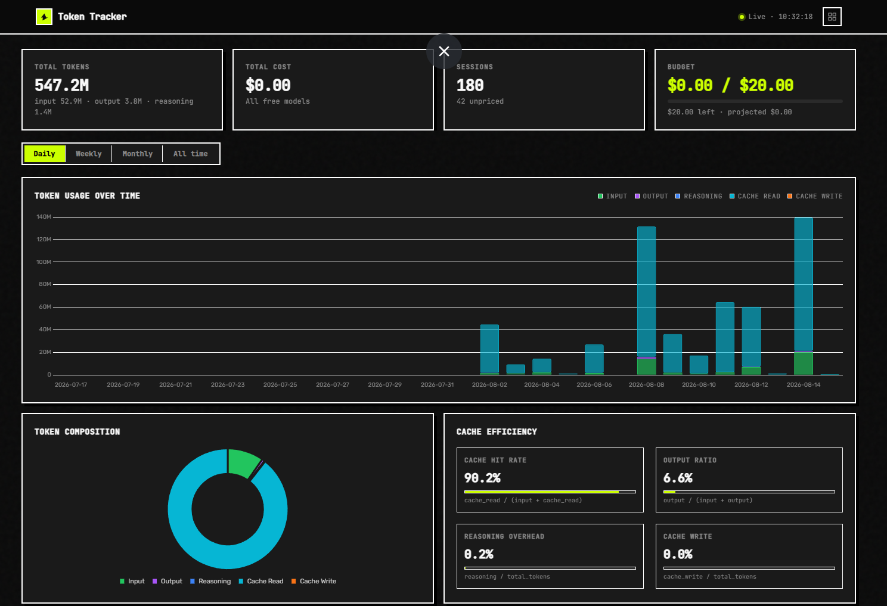

# Token Tracker for OpenCode

[](https://www.npmjs.com/package/opencode-token-tracker-cli)
[](https://www.npmjs.com/package/opencode-token-tracker-cli)
[](https://github.com/beast-ofcourse/token-tracker-for-opencode/actions)
[](LICENSE)

A local, read-only dashboard and CLI that tracks OpenCode's token usage, cost, and budget — straight from OpenCode's own SQLite database. No plugins, no hooks, no cloud.

## Theme showcase

| Dark | White | Brutalist Maximalist |
|------|-------|----------------------|
|  |  |  |

## Why this exists

OpenCode stores detailed session data in a local SQLite database, but there's no built-in way to see how much you're spending across sessions, models, and projects. Token Tracker reads that database and turns it into a clean dashboard with cost tracking, budget alerts, and per-model breakdowns — entirely locally.

## Features

- **Web dashboard** — dark / light / brutalist-maximalist themes, auto-refreshes every 30s, responsive on mobile
- **Stacked token charts** — input, output, reasoning, cache read/write over time
- **Cost tracking** — per-model and per-project cost breakdowns with configurable pricing
- **Budget alerts** — monthly budget with 80% warning and 100% exceeded thresholds
- **Cache efficiency metrics** — hit rate, output ratio, reasoning overhead
- **Session activity** — recent sessions with model, agent, token counts, and cost
- **CLI summary** — monthly spend and token totals in the terminal
- **CSV export** — session data exportable for spreadsheet analysis
- **Dual install** — pip (Python) or npm (bundled Python wrapper)

## Requirements

- Python 3.11+ (required by both install paths — the npm package ships the Python CLI)
- OpenCode installed and used at least once (it provides the SQLite database)

## Quick start

### Python (recommended)

```bash
pip install -r requirements.txt
python -m tracker serve
```

Dashboard opens at `http://127.0.0.1:8765`.

### npm

```bash
npm install -g opencode-token-tracker-cli
tracker serve
```

Or without installing:

```bash
npx opencode-token-tracker-cli serve
```

> The `serve` command needs Python web dependencies (FastAPI + Uvicorn). Install them once with `pip install -r requirements.txt`. The `summary` and `sessions` commands work without them.

## CLI usage

```bash
python -m tracker summary                            # current month summary
python -m tracker summary --month 2026-07            # specific month
python -m tracker summary --project my-app           # filter by project
python -m tracker summary --json                     # JSON output
python -m tracker sessions                           # list recent sessions
python -m tracker sessions --csv out.csv             # export sessions to CSV
python -m tracker sessions --model opencode/deepseek-v4-flash-free
python -m tracker sessions --from 2026-07-01 --to 2026-07-31
python -m tracker serve --port 9000                  # custom port
python -m tracker summary --config /path/to/config.json
```

With npm:

```bash
tracker summary
tracker sessions --csv sessions.csv
tracker serve --port 9000
```

## Configuration

Configuration is optional — without a `config.json`, sensible defaults are used. To customize, copy the example and edit as needed:

```bash
cp config.example.json config.json     # Unix/Mac
copy config.example.json config.json   # Windows
```

```json
{
  "db_path": "~/.local/share/opencode/opencode.db",
  "budget": { "monthly": 20.0, "currency": "USD", "reset_day": 1 },
  "severity": { "high_cost": 5.0, "med_cost": 1.0 },
  "pricing": {
    "openai/gpt-4o": { "input": 2.50, "output": 10.00, "cache_read": 1.25, "cache_write": 2.50 }
  },
  "server": { "host": "127.0.0.1", "port": 8765 },
  "refresh_seconds": 30
}
```

| Key | Purpose | Default |
|---|---|---|
| `db_path` | Path to OpenCode's SQLite database | `~/.local/share/opencode/opencode.db` |
| `budget` | Monthly spend budget, currency, and reset day | `$20.00`, USD, day 1 |
| `severity` | Cost thresholds that flag sessions as high/medium cost | high `5.0`, medium `1.0` |
| `pricing` | Per-model prices in USD per 1M tokens | Built-in table for common models |
| `server` | Host and port for the dashboard | `127.0.0.1:8765` |
| `refresh_seconds` | How often the dashboard polls the API | `30` |

**Pricing** is USD per 1M tokens. Models ending in `-free` price at $0 automatically. Models with no pricing entry fall back to the cost recorded in the database.

### Environment variables

| Variable | Purpose | Default |
|---|---|---|
| `OPENCODE_DB` | Override database path (takes precedence over `db_path`) | `~/.local/share/opencode/opencode.db` |
| `TRACKER_PYTHON` | Python interpreter used by the npm wrapper | system `python` |

## How it works

1. Opens `~/.local/share/opencode/opencode.db` in **read-only** mode (`mode=ro` + `PRAGMA query_only`, WAL-safe)
2. If the read-only open fails (e.g. a missing `-shm` file on Windows), falls back to a snapshot copy in a temp directory
3. Computes costs from the pricing table
4. Serves a static dashboard via FastAPI + Uvicorn
5. Dashboard polls the API every `refresh_seconds` (default 30s) for live updates

## Dashboard sections

| Section | Description |
|---|---|
| **Stat cards** | Total tokens, total cost, sessions, budget progress |
| **Token usage over time** | Stacked bar chart (input/output/reasoning/cache) |
| **Cost over time** | Line chart of cost trends (hidden when all free) |
| **Token composition** | Doughnut chart of token type breakdown |
| **Cache efficiency** | Hit rate, output ratio, reasoning overhead, cache write |
| **Cost / tokens by model** | Horizontal bar charts |
| **Usage by project / agent** | Horizontal bar charts |
| **Session activity** | Bar chart of session counts over time |
| **Model / Project / Agent breakdown** | Detailed tables with percentages |
| **Recent sessions** | Last 20 sessions with model, agent, tokens, cost |

## Budget tracking

Monthly budget with configurable reset day (default: 1st of month).

- **< 80%** — green (on track)
- **80–100%** — amber warning
- **> 100%** — red exceeded

Month-end projection: `spent / elapsed_days × total_days`.

## Troubleshooting

| Issue | Fix |
|---|---|
| DB not found | Set `OPENCODE_DB` or fix `db_path` in `config.json` |
| Port busy | Try `--port 9000` |
| WAL read-only failure | Auto-falls back to a snapshot copy in a temp dir |
| Missing web dependency (`fastapi`) | Run `pip install -r requirements.txt` |
| npm wrapper can't find Python | Set `TRACKER_PYTHON` to a Python 3.11+ interpreter |

## Development

```bash
pip install -r requirements.txt
pip install -r requirements-dev.txt
python -m tracker serve          # start dev server
python -m pytest                 # run tests
```

## Project structure

```text
tracker/          Python package (CLI, API, DB, pricing, aggregation, dashboard)
bin/tracker.js    npm wrapper entry point
config.example.json
```

## License

MIT